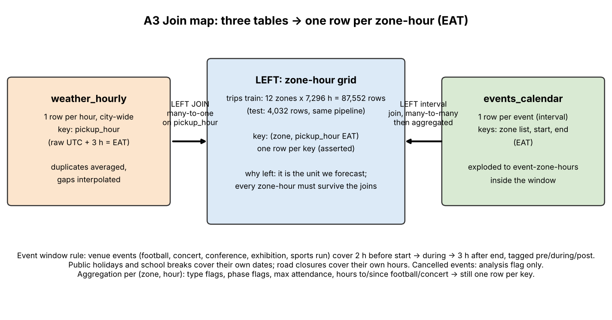

# A — Data Cleaning & Integration Pipeline (team teamdev)

Generated by `notebooks/01_cleaning_and_integration.ipynb` (code in `src/cleaning.py`, `src/features.py`). All timestamps are Addis Ababa local time (EAT, UTC+3).


## A1 Cleaning log

28 issues: 11 in the trip file, 8 in the weather file, 9 in the events file. Row counts are against the raw file (weather/event grid rows against the cleaned grid). Also saved as `reports/A1_cleaning_log.csv`.

| file                  | columns                      | issue_type                                                                                                                                      |   rows_affected |   pct_rows | fix_applied                                                                                               | why                                                                                                                                        |
|:----------------------|:-----------------------------|:------------------------------------------------------------------------------------------------------------------------------------------------|----------------:|-----------:|:----------------------------------------------------------------------------------------------------------|:-------------------------------------------------------------------------------------------------------------------------------------------|
| ride_demand_train.csv | zone                         | inconsistent zone spelling (55 variants: case, trailing spaces, C.M.C, Piazza, Mercato, Megenaga, Kazanches, Bole Rd, Kolfe Keranio)            |           32391 |      37.90 | mapped to 12 canonical labels via an explicit alias table                                                 | zone is the join key to weather/events and the grouping key for every model                                                                |
| ride_demand_train.csv | pickup_hour                  | 3 timestamp formats (YYYY-MM-DD HH:MM, DD/MM/YYYY HH:MM, ISO with +03:00)                                                                       |           38574 |      45.14 | parsed each format with an explicit format string; ISO offsets converted to EAT                           | inferred parsing would read day-first dates as month-first                                                                                 |
| ride_demand_train.csv | trips                        | sentinel value -1 (impossible for a count/duration)                                                                                             |             681 |       0.80 | set to missing                                                                                            | -1 is a 'no reading' code; keeping it biases means and the model target                                                                    |
| ride_demand_train.csv | avg_wait_min                 | sentinel value -1 (impossible for a count/duration)                                                                                             |            1707 |       2.00 | set to missing                                                                                            | -1 is a 'no reading' code; keeping it biases means and the model target                                                                    |
| ride_demand_train.csv | trips                        | blank target                                                                                                                                    |             845 |       0.99 | kept as a missing zone-hour in the grid; excluded from training and scoring                               | imputing the target would invent training labels                                                                                           |
| ride_demand_train.csv | avg_fare_birr                | blank fare                                                                                                                                      |            1277 |       1.49 | left missing; zone medians used where a fare is needed (demo revenue)                                     | fare is analysis-only, never a model input                                                                                                 |
| ride_demand_train.csv | trips                        | inflated counts: trips/active_drivers >= 4.0 (normal ~1.3, no valid row above 2.7); 99% are exact multiples of 8                                |             125 |       0.15 | divided by 8 (restores ~1.3 trips per driver)                                                             | drivers, wait and fare stay normal on these rows, so the trip count was multiplied in export; a real surge would also raise active drivers |
| ride_demand_train.csv | zone, pickup_hour            | duplicate zone-hour keys (same hour written in different formats/spellings; some with conflicting trips)                                        |            1692 |       1.98 | collapsed to one row per zone-hour: mean of valid values per column                                       | 480 rows were exact copies; the rest differ by a trip or two, so the mean is the least-biased single value                                 |
| ride_demand_train.csv | (rows)                       | zone not launched yet (Ayat starts 15 Mar 2025)                                                                                                 |            1752 |       2.00 | kept in grid as status 'prelaunch'; excluded from training and analysis means                             | zero demand before launch is not a demand pattern                                                                                          |
| ride_demand_train.csv | (rows)                       | platform outage: no zone has data 12 May 02:00-13 May 19:00 (42 h)                                                                              |             504 |       0.58 | kept in grid as status 'outage'; excluded from training                                                   | missing because the platform was down, not because demand was zero                                                                         |
| ride_demand_train.csv | (rows)                       | random missing zone-hours (isolated records absent)                                                                                             |             682 |       0.78 | kept in grid as 'random_gap'; lag features leave them NaN                                                 | scattered single hours; no evidence of a pattern                                                                                           |
| weather_hourly.csv    | timestamp                    | 2 formats: ISO with 'Z' and DD/MM/YYYY HH:MM without a zone                                                                                     |             732 |       9.71 | parsed each with an explicit format; both shown to be on UTC (same temperature curve, see A2c)            | a missing 'Z' does not mean local time                                                                                                     |
| weather_hourly.csv    | timestamp                    | clock is UTC, trips are EAT (UTC+3)                                                                                                             |            7538 |     100.00 | added 3 hours to every weather timestamp                                                                  | forecast rows start 31 Oct 21:00 raw = 1 Nov 00:00 EAT; temperature peaks 12:00 raw = 15:00 EAT                                            |
| weather_hourly.csv    | temp_c                       | temperature recorded in degF for 15 days (10 Jul-24 Jul, values 54-77)                                                                          |             354 |       4.70 | converted (F - 32) x 5/9 for every row of a day whose median exceeds 35                                   | a 60 degC hour is impossible in Addis; converted values join the neighbouring days smoothly                                                |
| weather_hourly.csv    | rain_mm                      | sentinel -9999 for 'no reading'                                                                                                                 |              76 |       1.01 | set to missing, then interpolated (below)                                                                 | would wreck every rain average                                                                                                             |
| weather_hourly.csv    | temp_c                       | blank reading                                                                                                                                   |              42 |       0.56 | time-interpolated from neighbouring hours                                                                 | weather changes smoothly hour to hour                                                                                                      |
| weather_hourly.csv    | humidity_pct                 | blank reading                                                                                                                                   |             153 |       2.03 | time-interpolated from neighbouring hours                                                                 | weather changes smoothly hour to hour                                                                                                      |
| weather_hourly.csv    | timestamp                    | duplicate hours with conflicting values                                                                                                         |             150 |       1.99 | averaged to one row per hour (data_type kept)                                                             | no way to know which reading is right; the mean halves the error                                                                           |
| weather_hourly.csv    | timestamp                    | missing hours (gaps in the hourly series)                                                                                                       |             193 |       2.56 | reindexed to a full hourly series and time-interpolated (rain: interpolated, never negative)              | every zone-hour needs a weather row for the many-to-one join                                                                               |
| events_calendar.csv   | event_type                   | 20 spellings of 8 types (case, spaces vs underscores)                                                                                           |              94 |      56.97 | lower-cased, spaces to underscores, validated against the 8-type list                                     | type drives the window rule and the per-type features                                                                                      |
| events_calendar.csv   | zone                         | zone text not a clean label: case variants, extra text in brackets ('Kazanchis (Kirkos)'), multi-zone 'A & B', Citywide/ALL/All zones/city-wide |              87 |      52.73 | parsed to a list of canonical zones; city-wide expands to all 12                                          | an event affects demand only in the zones it touches                                                                                       |
| events_calendar.csv   | start_datetime, end_datetime | 3 date formats (YYYY-MM-DD, day-first DD/MM/YYYY, 'Feb 06, 2025 08:00 PM')                                                                      |             129 |      78.18 | explicit format per pattern; day-first confirmed (first field > 12 on many rows, second field never > 12) | month-first parsing would move events by months                                                                                            |
| events_calendar.csv   | status                       | inconsistent case/whitespace (confirmed, Confirmed, CONFIRMED, 'CONFIRMED ', CANCELLED)                                                         |              28 |      16.97 | lower-cased and stripped                                                                                  | cancelled events must be identified reliably                                                                                               |
| events_calendar.csv   | (rows)                       | duplicate events re-entered under a new id (EVT-9xxx)                                                                                           |               6 |       3.64 | dropped the later copy                                                                                    | a duplicated event would double its feature values                                                                                         |
| events_calendar.csv   | end_datetime                 | missing end time                                                                                                                                |               4 |       2.42 | filled with start + median duration of that event type                                                    | every event needs an interval for the window join                                                                                          |
| events_calendar.csv   | end_datetime                 | end earlier than start                                                                                                                          |               1 |       0.61 | replaced with start + median duration of that event type                                                  | a swap would give a 2 h exhibition, so the end itself is wrong                                                                             |
| events_calendar.csv   | expected_attendance          | free text ('approx 34000', '16,007')                                                                                                            |              23 |      13.94 | kept digits only                                                                                          | attendance becomes a numeric feature                                                                                                       |
| events_calendar.csv   | expected_attendance          | blank attendance                                                                                                                                |              53 |      32.12 | filled with the median of the same event type (holidays, closures, breaks stay 0)                         | most blanks are types where attendance is meaningless                                                                                      |


## A2 Time & key standardization


### A2a Zone and event-type labels, before and after

All three tables end with the same 12 zone labels: Arat Kilo, Ayat, Bole, CMC, Gerji, Kazanchis, Kolfe, Lideta, Megenagna, Merkato, Piassa, Sarbet. Raw values are shown with `repr` so trailing spaces are visible.

| table / column    |   unique raw values |   unique cleaned values |
|:------------------|--------------------:|------------------------:|
| train.zone        |                  55 |                      12 |
| test.zone         |                  55 |                      12 |
| events.zone       |                  28 |                      12 |
| events.event_type |                  20 |                       8 |

**Trip file zone**

| raw             |   rows | cleaned   |
|:----------------|-------:|:----------|
| 'ARAT KILO'     |    677 | Arat Kilo |
| 'Arat  Kilo'    |    705 | Arat Kilo |
| 'Arat Kilo '    |    655 | Arat Kilo |
| 'Arat Kilo'     |   4506 | Arat Kilo |
| 'arat kilo'     |    729 | Arat Kilo |
| 'AYAT'          |    675 | Ayat      |
| 'Ayat '         |    721 | Ayat      |
| 'Ayat'          |   3382 | Ayat      |
| 'ayat'          |    729 | Ayat      |
| 'BOLE'          |    674 | Bole      |
| 'Bole '         |    710 | Bole      |
| 'Bole Rd'       |    689 | Bole      |
| 'Bole'          |   4507 | Bole      |
| 'bole'          |    689 | Bole      |
| 'C.M.C'         |    880 | CMC       |
| 'CMC '          |    945 | CMC       |
| 'CMC'           |   4559 | CMC       |
| 'cmc'           |    886 | CMC       |
| 'GERJI'         |    915 | Gerji     |
| 'Gerji '        |    906 | Gerji     |
| 'Gerji'         |   4523 | Gerji     |
| 'gerji'         |    924 | Gerji     |
| 'KAZANCHIS'     |    704 | Kazanchis |
| 'Kazanches'     |    657 | Kazanchis |
| 'Kazanchis '    |    674 | Kazanchis |
| 'Kazanchis'     |   4550 | Kazanchis |
| 'kazanchis'     |    694 | Kazanchis |
| 'KOLFE'         |    688 | Kolfe     |
| 'Kolfe '        |    726 | Kolfe     |
| 'Kolfe Keranio' |    681 | Kolfe     |
| 'Kolfe'         |   4456 | Kolfe     |
| 'kolfe'         |    714 | Kolfe     |
| 'LIDETA'        |    912 | Lideta    |
| 'Lideta '       |    944 | Lideta    |
| 'Lideta'        |   4514 | Lideta    |
| 'lideta'        |    906 | Lideta    |
| 'MEGENAGNA'     |    664 | Megenagna |
| 'Megenaga'      |    652 | Megenagna |
| 'Megenagna '    |    701 | Megenagna |
| 'Megenagna'     |   4593 | Megenagna |
| 'megenagna'     |    655 | Megenagna |
| 'MERKATO'       |    753 | Merkato   |
| 'Mercato'       |    660 | Merkato   |
| 'Merkato '      |    686 | Merkato   |
| 'Merkato'       |   4470 | Merkato   |
| 'merkato'       |    697 | Merkato   |
| 'PIASSA'        |    718 | Piassa    |
| 'Piassa '       |    641 | Piassa    |
| 'Piassa'        |   4563 | Piassa    |
| 'Piazza'        |    639 | Piassa    |
| 'piassa'        |    707 | Piassa    |
| 'SARBET'        |    925 | Sarbet    |
| 'Sarbet '       |    945 | Sarbet    |
| 'Sarbet'        |   4446 | Sarbet    |
| 'sarbet'        |    939 | Sarbet    |

**Test file zone**

| raw             |   rows | cleaned   |
|:----------------|-------:|:----------|
| 'ARAT KILO'     |     37 | Arat Kilo |
| 'Arat  Kilo'    |     30 | Arat Kilo |
| 'Arat Kilo '    |     38 | Arat Kilo |
| 'Arat Kilo'     |    208 | Arat Kilo |
| 'arat kilo'     |     23 | Arat Kilo |
| 'AYAT'          |     45 | Ayat      |
| 'Ayat '         |     46 | Ayat      |
| 'Ayat'          |    204 | Ayat      |
| 'ayat'          |     41 | Ayat      |
| 'BOLE'          |     35 | Bole      |
| 'Bole '         |     30 | Bole      |
| 'Bole Rd'       |     26 | Bole      |
| 'Bole'          |    222 | Bole      |
| 'bole'          |     23 | Bole      |
| 'C.M.C'         |     44 | CMC       |
| 'CMC '          |     43 | CMC       |
| 'CMC'           |    209 | CMC       |
| 'cmc'           |     40 | CMC       |
| 'GERJI'         |     50 | Gerji     |
| 'Gerji '        |     41 | Gerji     |
| 'Gerji'         |    196 | Gerji     |
| 'gerji'         |     49 | Gerji     |
| 'KAZANCHIS'     |     31 | Kazanchis |
| 'Kazanches'     |     39 | Kazanchis |
| 'Kazanchis '    |     35 | Kazanchis |
| 'Kazanchis'     |    201 | Kazanchis |
| 'kazanchis'     |     30 | Kazanchis |
| 'KOLFE'         |     31 | Kolfe     |
| 'Kolfe '        |     41 | Kolfe     |
| 'Kolfe Keranio' |     36 | Kolfe     |
| 'Kolfe'         |    194 | Kolfe     |
| 'kolfe'         |     34 | Kolfe     |
| 'LIDETA'        |     36 | Lideta    |
| 'Lideta '       |     52 | Lideta    |
| 'Lideta'        |    208 | Lideta    |
| 'lideta'        |     40 | Lideta    |
| 'MEGENAGNA'     |     36 | Megenagna |
| 'Megenaga'      |     28 | Megenagna |
| 'Megenagna '    |     31 | Megenagna |
| 'Megenagna'     |    203 | Megenagna |
| 'megenagna'     |     38 | Megenagna |
| 'MERKATO'       |     28 | Merkato   |
| 'Mercato'       |     26 | Merkato   |
| 'Merkato '      |     35 | Merkato   |
| 'Merkato'       |    223 | Merkato   |
| 'merkato'       |     24 | Merkato   |
| 'PIASSA'        |     31 | Piassa    |
| 'Piassa '       |     29 | Piassa    |
| 'Piassa'        |    208 | Piassa    |
| 'Piazza'        |     36 | Piassa    |
| 'piassa'        |     32 | Piassa    |
| 'SARBET'        |     35 | Sarbet    |
| 'Sarbet '       |     42 | Sarbet    |
| 'Sarbet'        |    218 | Sarbet    |
| 'sarbet'        |     41 | Sarbet    |

**Events zone (multi-zone and city-wide rows expand to several zones)**

| raw                     |   rows | cleaned              |
|:------------------------|-------:|:---------------------|
| 'ALL'                   |      3 | ALL 12 zones         |
| 'All zones'             |      2 | ALL 12 zones         |
| 'Citywide'              |      9 | ALL 12 zones         |
| 'city-wide'             |      1 | ALL 12 zones         |
| 'arat kilo'             |      1 | Arat Kilo            |
| 'Kazanchis & Arat Kilo' |      1 | Arat Kilo, Kazanchis |
| 'Arat Kilo & SARBET'    |      1 | Arat Kilo, Sarbet    |
| 'AYAT'                  |      2 | Ayat                 |
| 'Ayat'                  |      1 | Ayat                 |
| 'Ayat & Lideta'         |      1 | Ayat, Lideta         |
| 'BOLE'                  |      5 | Bole                 |
| 'Bole (Bole subcity)'   |     10 | Bole                 |
| 'Bole'                  |     29 | Bole                 |
| 'CMC'                   |      1 | CMC                  |
| 'cmc'                   |      2 | CMC                  |
| 'Gerji'                 |      1 | Gerji                |
| 'KAZANCHIS'             |     19 | Kazanchis            |
| 'Kazanchis (Kirkos)'    |     23 | Kazanchis            |
| 'Kazanchis'             |     39 | Kazanchis            |
| 'Lideta & KAZANCHIS'    |      2 | Kazanchis, Lideta    |
| 'Kolfe Keranio'         |      1 | Kolfe                |
| 'Kolfe'                 |      1 | Kolfe                |
| 'Lideta'                |      2 | Lideta               |
| 'MEGENAGNA'             |      1 | Megenagna            |
| 'Megenagna'             |      1 | Megenagna            |
| 'Piassa (Arada)'        |      2 | Piassa               |
| 'Piassa'                |      3 | Piassa               |
| 'Piazza'                |      1 | Piassa               |

**Events event_type**

| raw               |   rows | cleaned        |
|:------------------|-------:|:---------------|
| 'CONCERT'         |     14 | concert        |
| 'Concert'         |      6 | concert        |
| 'concert'         |      8 | concert        |
| 'Conference'      |     19 | conference     |
| 'conference'      |     19 | conference     |
| 'Exhibition'      |      3 | exhibition     |
| 'exhibition'      |      4 | exhibition     |
| 'Football Match'  |     15 | football_match |
| 'football match ' |     14 | football_match |
| 'football_match'  |     22 | football_match |
| 'Public Holiday'  |      5 | public_holiday |
| 'public holiday'  |      2 | public_holiday |
| 'public_holiday'  |      6 | public_holiday |
| 'Road closure'    |      3 | road_closure   |
| 'road closure'    |     11 | road_closure   |
| 'road_closure'    |      9 | road_closure   |
| 'School Break'    |      1 | school_break   |
| 'school_break'    |      1 | school_break   |
| 'Sports Run'      |      1 | sports_run     |
| 'sports_run'      |      2 | sports_run     |


### A2b Timestamp formats

Every format is matched by a regular expression and parsed with an explicit `format=` string (never inferred). *Round-trip equal* re-formats each parsed timestamp with the same pattern and compares it to the raw text: 100% everywhere means nothing was misread (for ISO `+03:00` the parsed value is already EAT, so it round-trips to the same text).

| column                | format       | parse rule                              |   rows | example raw               | parsed              |   unparsed | round-trip equal   |
|:----------------------|:-------------|:----------------------------------------|-------:|:--------------------------|:--------------------|-----------:|:-------------------|
| train.pickup_hour     | dmy_hm       | %d/%m/%Y %H:%M (day-first)              |  25764 | 16/08/2025 04:00          | 2025-08-16 04:00:00 |          0 | 100%               |
| train.pickup_hour     | iso_offset   | %Y-%m-%dT%H:%M:%S%z -> converted to EAT |  12810 | 2025-05-27T23:00:00+03:00 | 2025-05-27 23:00:00 |          0 | 100%               |
| train.pickup_hour     | ymd_hm       | %Y-%m-%d %H:%M                          |  46886 | 2025-06-26 11:00          | 2025-06-26 11:00:00 |          0 | 100%               |
| test.pickup_hour      | dmy_hm       | %d/%m/%Y %H:%M (day-first)              |   1198 | 05/11/2025 14:00          | 2025-11-05 14:00:00 |          0 | 100%               |
| test.pickup_hour      | iso_offset   | %Y-%m-%dT%H:%M:%S%z -> converted to EAT |    573 | 2025-11-03T20:00:00+03:00 | 2025-11-03 20:00:00 |          0 | 100%               |
| test.pickup_hour      | ymd_hm       | %Y-%m-%d %H:%M                          |   2261 | 2025-11-05 18:00          | 2025-11-05 18:00:00 |          0 | 100%               |
| weather.timestamp     | dmy_hm       | %d/%m/%Y %H:%M (day-first)              |    732 | 31/12/2024 15:00          | 2024-12-31 15:00:00 |          0 | 100%               |
| weather.timestamp     | iso_z        | %Y-%m-%dT%H:%M:%SZ                      |   6806 | 2024-12-30T21:00:00Z      | 2024-12-30 21:00:00 |          0 | 100%               |
| events.start_datetime | dmy_hm       | %d/%m/%Y %H:%M (day-first)              |     50 | 06/02/2025 18:00          | 2025-02-06 18:00:00 |          0 | 100%               |
| events.start_datetime | mon_d_y_ampm | %b %d, %Y %I:%M %p                      |     36 | May 14, 2025 01:00 PM     | 2025-05-14 13:00:00 |          0 | 100%               |
| events.start_datetime | ymd_hm       | %Y-%m-%d %H:%M                          |     79 | 2025-06-07 08:00          | 2025-06-07 08:00:00 |          0 | 100%               |
| events.end_datetime   | dmy_hm       | %d/%m/%Y %H:%M (day-first)              |     47 | 07/06/2025 18:00          | 2025-06-07 18:00:00 |          0 | 100%               |
| events.end_datetime   | missing      | (blank)                                 |      4 | nan                       | NaT                 |          0 | n/a                |
| events.end_datetime   | mon_d_y_ampm | %b %d, %Y %I:%M %p                      |     33 | Feb 06, 2025 08:00 PM     | 2025-02-06 20:00:00 |          0 | 100%               |
| events.end_datetime   | ymd_hm       | %Y-%m-%d %H:%M                          |     81 | 2025-08-13 21:00          | 2025-08-13 21:00:00 |          0 | 100%               |

**Day-first proof.** In every slash-formatted column many rows have a first field above 12 (impossible for a month) and no row has a second field above 12 (which month-first data would need), so `dd/mm/yyyy` is the only consistent reading.

| column                |   rows |   first_field_gt_12 |   second_field_gt_12 |
|:----------------------|-------:|--------------------:|---------------------:|
| train.pickup_hour     |  25764 |               15713 |                    0 |
| test.pickup_hour      |   1198 |                 167 |                    0 |
| weather.timestamp     |    732 |                 412 |                    0 |
| events.start_datetime |     50 |                  28 |                    0 |
| events.end_datetime   |     47 |                  17 |                    0 |


### A2c Clock of each table and the conversion

| table              | clock   | evidence from the data                                                                                                                                                                                                                                                    | conversion applied   |
|:-------------------|:--------|:--------------------------------------------------------------------------------------------------------------------------------------------------------------------------------------------------------------------------------------------------------------------------|:---------------------|
| trips (train/test) | EAT     | ISO rows carry '+03:00' (12,810 train / 573 test); 214 zone-hours appear both as ISO and as a plain format, and 100% of those pairs have identical active_drivers -> plain formats are EAT too                                                                            | none                 |
| weather            | UTC     | first raw row 30 Dec 2024 21:00, last 14 Nov 2025 20:00; first forecast row 31 Oct 21:00 raw = 1 Nov 00:00 EAT only if the raw clock is UTC; temperature peaks at 12:00 raw = 15:00 EAT (mid-afternoon); dd/mm/yyyy rows best match the 'Z' rows at shift 0 h (r = 0.996) | +3 h on every row    |
| events             | EAT     | holidays run 00:00-23:59 and football matches start 15:00-19:00 local; documented as local time                                                                                                                                                                           | none                 |

**Conclusion.** The weather export is on UTC — including the 732 rows written without a 'Z'. The decisive evidence is the forecast boundary: forecasts must start at the first forecast hour, 1 Nov 00:00 EAT, and the first forecast row is stamped 31 Oct 21:00, exactly 3 hours earlier. We add 3 hours to every weather timestamp. B2.1 shows the same answer from the rain–demand relationship.

|   raw hour |   mean temp, dd/mm rows |   mean temp, 'Z' rows |
|-----------:|------------------------:|----------------------:|
|          0 |                   11.30 |                 11.60 |
|          1 |                   11.70 |                 11.80 |
|          2 |                   12.70 |                 12.30 |
|          3 |                   13.30 |                 13.30 |
|          4 |                   14.20 |                 14.40 |
|          5 |                   16.20 |                 15.70 |
|          6 |                   17.00 |                 17.20 |
|          7 |                   18.80 |                 18.50 |
|          8 |                   19.40 |                 19.80 |
|          9 |                   21.00 |                 20.90 |
|         10 |                   21.40 |                 21.70 |
|         11 |                   22.40 |                 22.10 |
|         12 |                   22.10 |                 22.30 |
|         13 |                   23.00 |                 21.90 |
|         14 |                   21.60 |                 21.50 |
|         15 |                   20.80 |                 20.60 |
|         16 |                   19.90 |                 19.40 |
|         17 |                   18.70 |                 18.20 |
|         18 |                   17.00 |                 17.00 |
|         19 |                   15.70 |                 15.60 |
|         20 |                   14.80 |                 14.30 |
|         21 |                   13.40 |                 13.30 |
|         22 |                   12.00 |                 12.40 |
|         23 |                   12.10 |                 11.80 |


## A3 Join map



* **Left table = the zone-hour grid** (train: every zone x every hour 1 Jan–31 Oct; test: the 4,032 test rows). It is the unit we forecast, so every zone-hour must survive the joins — including outage/missing hours, which keep a status flag rather than disappearing.
* **Weather: left join, many-to-one on `pickup_hour`** after shifting weather from UTC to EAT. The weather key is made unique first (duplicate hours averaged), so the row count cannot change.
* **Events: interval join.** Each event is expanded to (event, zone, hour) rows covering its window, then aggregated back to one row per (zone, hour). Window rule: venue events reach 2 h before the start (arrivals) and 3 h after the end (the departing crowd; the length is checked in A6b). Holidays and school breaks are day-level calendar items; road closures only cover their own hours.


## A4 Join audit

**Weather join (many-to-one on EAT hour)**

| join          |   rows_before |   rows_after |   matched |   match_rate_pct |   matched_to_imputed_weather_hour |   unmatched |
|:--------------|--------------:|-------------:|----------:|-----------------:|----------------------------------:|------------:|
| weather_train |         87552 |        87552 |     87552 |           100.00 |                              5280 |           0 |
| weather_test  |          4032 |         4032 |      4032 |           100.00 |                               180 |           0 |

Row counts are unchanged (87,552 -> 87,552 train, 4,032 -> 4,032 test) because weather keys were made unique before joining. Without that step, 75 duplicated weather hours would have duplicated their zone-hours (a many-to-many join) and 193 missing hours would have left zone-hours without weather. After reindexing + interpolation every zone-hour has weather (match rate 100%); 5,280 train and 180 test zone-hours use an interpolated hour (a gap, a blank value or a -9999 sentinel) and carry `weather_imputed = True`.

**Events join (interval join on zone + hour)**

| join         |   rows_before |   rows_after |   zone_hours_in_any_confirmed_window |   events_total |   events_matched_any_zone_hour |   events_matched_confirmed |   events_unmatched |
|:-------------|--------------:|-------------:|-------------------------------------:|---------------:|-------------------------------:|---------------------------:|-------------------:|
| events_train |         87552 |        87552 |                                24809 |            159 |                            152 |                        146 |                  7 |
| events_test  |          4032 |         4032 |                                   66 |            159 |                              7 |                          7 |                152 |

Of 159 cleaned events, 152 touch at least one training zone-hour (146 of them confirmed) and 7 touch the test fortnight. Excluded or unmatched:

| reason                                                |   events |
|:------------------------------------------------------|---------:|
| duplicate of another row (dropped in cleaning)        |        6 |
| cancelled (kept only as analysis flag)                |        6 |
| starts after 31 Oct (only reaches the test fortnight) |        7 |

Cancelled events are not model features (they did not happen); B3.4 tests whether they left any footprint.


## A5 Join proof


### Rain-affected zone-hour: Arat Kilo, Fri 02 May 2025 17:00 EAT

Weather row attached (raw UTC stamp 2025-05-02 14:00 = 17:00 EAT):

| timestamp            |   temp_c |   rain_mm |   humidity_pct |   wind_kmh | data_type   |
|:---------------------|---------:|----------:|---------------:|-----------:|:------------|
| 2025-05-02T14:00:00Z |    21.50 |     21.00 |          76.00 |       6.10 | observed    |

Event rows attached: none.

Resulting master-table values:

| zone      | pickup_hour         |   trips |   temp_c |   rain_mm |   rain_3h |   rain_class |   is_public_holiday |   ev_football_window |   ev_pre |   ev_during |   ev_post |   ev_log_attendance |   ev_hours_to_major_start |   ev_hours_since_major_end | ev_ids   |
|:----------|:--------------------|--------:|---------:|----------:|----------:|-------------:|--------------------:|---------------------:|---------:|------------:|----------:|--------------------:|--------------------------:|---------------------------:|:---------|
| Arat Kilo | 2025-05-02 17:00:00 |   96.00 |    21.50 |     21.00 |     21.80 |            3 |                0.00 |                 0.00 |     0.00 |        0.00 |      0.00 |                0.00 |                     12.00 |                      12.00 |          |


### Inside a football event window: Kazanchis, Sun 26 Jan 2025 17:00 EAT

Weather row attached (raw UTC stamp 2025-01-26 14:00 = 17:00 EAT):

| timestamp            |   temp_c |   rain_mm |   humidity_pct |   wind_kmh | data_type   |
|:---------------------|---------:|----------:|---------------:|-----------:|:------------|
| 2025-01-26T14:00:00Z |    21.30 |      0.00 |          69.00 |       7.20 | observed    |

Event rows attached (window phase per event):

| event_id   | event_name           | event_type     | start               | end                 | phase   |   attendance | status    |
|:-----------|:---------------------|:---------------|:--------------------|:--------------------|:--------|-------------:|:----------|
| EVT-0007   | Premier league match | football_match | 2025-01-26 15:00:00 | 2025-01-26 17:00:00 | post    |     34756.00 | confirmed |

Resulting master-table values:

| zone      | pickup_hour         |   trips |   temp_c |   rain_mm |   rain_3h |   rain_class |   is_public_holiday |   ev_football_window |   ev_pre |   ev_during |   ev_post |   ev_log_attendance |   ev_hours_to_major_start |   ev_hours_since_major_end | ev_ids   |
|:----------|:--------------------|--------:|---------:|----------:|----------:|-------------:|--------------------:|---------------------:|---------:|------------:|----------:|--------------------:|--------------------------:|---------------------------:|:---------|
| Kazanchis | 2025-01-26 17:00:00 |   55.00 |    21.30 |      0.00 |      0.00 |            0 |                0.00 |                 1.00 |     0.00 |        0.00 |      1.00 |               10.46 |                     12.00 |                       1.00 | EVT-0007 |


### Public holiday: Merkato, Sat 27 Sep 2025 12:00 EAT

Weather row attached (raw UTC stamp 2025-09-27 09:00 = 12:00 EAT):

| timestamp            |   temp_c |   rain_mm |   humidity_pct |   wind_kmh | data_type   |
|:---------------------|---------:|----------:|---------------:|-----------:|:------------|
| 2025-09-27T09:00:00Z |    20.30 |      0.00 |          61.00 |       7.50 | observed    |

Event rows attached (window phase per event):

| event_id   | event_name                         | event_type     | start               | end                 | phase   |   attendance | status    |
|:-----------|:-----------------------------------|:---------------|:--------------------|:--------------------|:--------|-------------:|:----------|
| EVT-0126   | Meskel (Finding of the True Cross) | public_holiday | 2025-09-27 00:00:00 | 2025-09-27 23:59:00 | during  |         0.00 | confirmed |

Resulting master-table values:

| zone    | pickup_hour         |   trips |   temp_c |   rain_mm |   rain_3h |   rain_class |   is_public_holiday |   ev_football_window |   ev_pre |   ev_during |   ev_post |   ev_log_attendance |   ev_hours_to_major_start |   ev_hours_since_major_end | ev_ids   |
|:--------|:--------------------|--------:|---------:|----------:|----------:|-------------:|--------------------:|---------------------:|---------:|------------:|----------:|--------------------:|--------------------------:|---------------------------:|:---------|
| Merkato | 2025-09-27 12:00:00 |   54.00 |    20.30 |      0.00 |      0.00 |            0 |                1.00 |                 0.00 |     0.00 |        0.00 |      0.00 |                0.00 |                     12.00 |                      12.00 | EVT-0126 |


## A6 Feature engineering table

35 engineered features: 9 calendar, 12 events, 6 lag / trend, 6 weather, 2 zone. Lags are at least 14 days old — the forecast horizon — so every one is known when the forecast for 1–14 November is made on 31 October. Fitted pieces (zone types, the zone x weekday x hour profile, attendance medians) are learned on training rows only.

| feature                  | family      | group             | formula                                          | description                                                                                     | why_it_should_help                                        | known_at_forecast_time   |
|:-------------------------|:------------|:------------------|:-------------------------------------------------|:------------------------------------------------------------------------------------------------|:----------------------------------------------------------|:-------------------------|
| hour                     | calendar    | calendar          | pickup_hour.hour                                 | Hour of day 0-23                                                                                | demand has strong commuter/market/nightlife hourly shapes | yes                      |
| dow                      | calendar    | calendar          | pickup_hour.dayofweek                            | Day of week, 0 = Monday                                                                         | business zones empty at weekends, nightlife zones fill    | yes                      |
| is_weekend               | calendar    | calendar          | dow >= 5                                         | 1 on Saturday/Sunday                                                                            | same as dow, simpler split                                | yes                      |
| month                    | calendar    | calendar          | pickup_hour.month                                | Month 1-12                                                                                      | seasonal level shifts                                     | yes                      |
| day_of_month             | calendar    | calendar          | pickup_hour.day                                  | Day of month                                                                                    | pay-cycle effects                                         | yes                      |
| is_payday_window         | calendar    | calendar          | day > days_in_month - 5 or day <= 2              | 1 in the last 5 days or first 2 days of a month                                                 | more spending money around payday (B4.3)                  | yes                      |
| is_public_holiday        | calendar    | events            | interval join, public_holiday rows               | 1 if a confirmed public holiday covers the hour                                                 | holidays change the whole day's pattern                   | yes                      |
| is_school_break          | calendar    | events            | interval join, school_break rows                 | 1 inside a confirmed school break                                                               | fewer school runs                                         | yes                      |
| trend_days               | calendar    | calendar          | (pickup_hour - 2025-01-01) / 1 day               | Days since 1 Jan 2025                                                                           | city demand grows ~40% Jan-Oct (B1.4)                     | yes                      |
| zone_code                | zone        | zone              | index in config.ZONES                            | Integer code of the zone                                                                        | zone levels differ 2x                                     | yes                      |
| zone_type_code           | zone        | zone              | index in ZONE_TYPE_ORDER                         | Integer code of zone_type                                                                       | shares hourly shape across similar zones                  | yes                      |
| temp_c                   | weather     | weather           | joined on EAT hour                               | Air temperature, degC (degF block converted)                                                    | comfort affects walking vs riding                         | yes (forecast)           |
| rain_mm                  | weather     | weather           | joined on EAT hour; -9999 -> NaN -> interpolated | Rain in the previous hour, mm                                                                   | rain pushes people into cars                              | yes (forecast)           |
| rain_3h                  | weather     | weather           | rolling 3-hour sum of rain_mm                    | Rain over the current and previous 2 hours, mm                                                  | people react to rain that has been falling                | yes (forecast)           |
| rain_class               | weather     | weather           | bins of rain_mm                                  | 0 none, 1 light (<=2.5), 2 moderate (<=7.5), 3 heavy                                            | response to rain may saturate (B2.3)                      | yes (forecast)           |
| humidity_pct             | weather     | weather           | joined; blanks interpolated                      | Relative humidity, %                                                                            | proxy for rain risk                                       | yes (forecast)           |
| wind_kmh                 | weather     | weather           | joined                                           | Wind speed, km/h                                                                                | minor comfort effect                                      | yes (forecast)           |
| ev_football_window       | events      | events            | interval join                                    | 1 if a confirmed football match window (2 h before start to 3 h after end) covers the zone-hour | match crowds arrive and leave by ride                     | yes                      |
| ev_concert_window        | events      | events            | interval join                                    | 1 inside a confirmed concert window                                                             | late-night concert crowds                                 | yes                      |
| ev_conference_window     | events      | events            | interval join                                    | 1 inside a confirmed conference window                                                          | business travel to venues                                 | yes                      |
| ev_exhibition_window     | events      | events            | interval join                                    | 1 inside a confirmed exhibition window                                                          | multi-day visitor flow                                    | yes                      |
| ev_road_closure          | events      | events            | interval join                                    | 1 during a confirmed road closure                                                               | closures can suppress pickups                             | yes                      |
| ev_sports_run_window     | events      | events            | interval join                                    | 1 inside a confirmed sports run window                                                          | mass participation events                                 | yes                      |
| ev_pre                   | events      | events            | phase of window                                  | 1 in the 2 h before a venue event starts                                                        | arrival rush                                              | yes                      |
| ev_during                | events      | events            | phase of window                                  | 1 while a venue event runs                                                                      | demand often dips while attendees are inside              | yes                      |
| ev_post                  | events      | events            | phase of window                                  | 1 in the 3 h after a venue event ends                                                           | the leaving crowd is the biggest surge                    | yes                      |
| ev_log_attendance        | events      | events            | free text -> number; blanks -> type median       | log(1 + expected attendance) of the largest active venue event                                  | bigger crowds, bigger surge                               | yes                      |
| ev_hours_to_major_start  | events      | events            | searchsorted on event starts                     | Hours until the next football/concert start in the zone, capped at 12                           | ramp-up before big events                                 | yes                      |
| ev_hours_since_major_end | events      | events            | searchsorted on event ends                       | Hours since the last football/concert ended in the zone, capped at 12                           | post-event surge decays over a few hours                  | yes                      |
| lag_14d                  | lag / trend | trips (history)   | shift by 336 h on the zone panel                 | Trips in the same zone and hour 14 days earlier                                                 | recent level including growth                             | yes                      |
| lag_21d                  | lag / trend | trips (history)   | shift by 504 h                                   | Same, 21 days earlier                                                                           | robustness                                                | yes                      |
| lag_28d                  | lag / trend | trips (history)   | shift by 672 h                                   | Same, 28 days earlier                                                                           | robustness                                                | yes                      |
| lag_mean_2to4w           | lag / trend | trips (history)   | row mean ignoring NaN                            | Mean of lag_14d, lag_21d, lag_28d                                                               | smoother same-hour level                                  | yes                      |
| profile_zone_dow_hour    | lag / trend | trips (train fit) | groupby mean on training rows only               | Mean trips for zone x weekday x hour over the training period                                   | typical shape (seasonal-naive)                            | yes                      |
| zone_level_2to4w         | lag / trend | trips (history)   | daily means, shift 14 d, rolling 14 d            | Zone mean trips per hour over the 14 days that end 14 days before the row's day                 | captures the growth trend that trees cannot extrapolate   | yes                      |


### A6b Event window check

Demand ratio (trips / normal hour of the same zone, weekday, hour and week) by hour relative to the event end. Concert demand is still about double normal in the 3rd hour after the end and is back to normal by the 4th; football is back to normal by the 3rd. We therefore use 2 h before the start and 3 h after the end as the window.

|   hour vs. event end (0 = last hour of the event, 1 = first hour after) |   football_match |   concert |
|------------------------------------------------------------------------:|-----------------:|----------:|
|                                                                      -2 |             1.77 |      1.06 |
|                                                                      -1 |             1.42 |      1.00 |
|                                                                       0 |             1.41 |      1.03 |
|                                                                       1 |             2.55 |      1.82 |
|                                                                       2 |             2.19 |      1.86 |
|                                                                       3 |             1.12 |      1.76 |
|                                                                       4 |             1.09 |      0.96 |
|                                                                       5 |             1.11 |      1.07 |


## A7 Integrity checks

18 automated checks (`features.validate`), all re-run every time this notebook runs. Printed output:

```
[PASS] train: one row per zone-hour (12 zones x 7,296 hours) (87,552 rows)
[PASS] test: 4,032 rows, row_ids unique and in original order (4,032 rows)
[PASS] test: no duplicate zone-hour keys
[PASS] only the 12 canonical zone labels
[PASS] timestamps on EAT and in expected range
[PASS] no negative or sentinel values left (trips, wait, rain) (min trips 0.0, min rain 0.0)
[PASS] temperature physically plausible (0-35 degC) after unit fix (range 5.4-28.0)
[PASS] no inflated trip spikes left (trips/driver <= 4)
[PASS] row count unchanged by weather join, train split (87552 -> 87552)
[PASS] row count unchanged by weather join, test split (4032 -> 4032)
[PASS] row count unchanged by events join, train split (87552 -> 87552)
[PASS] row count unchanged by events join, test split (4032 -> 4032)
[PASS] every zone-hour matched a weather row
[PASS] test weather comes from the forecast rows
[PASS] train and test have the same feature columns
[PASS] no operational (history-only) column among model features
[PASS] lags only reach >= 14 days back (horizon-safe)
[PASS] test lag_14d fully populated from history (97.1% non-missing)
```


## A8 Master tables and data dictionary

* `data/processed/master_train.csv` — 87,552 rows x 48 columns (full grid; train on `row_status == 'observed'`, 83,104 rows).
* `data/processed/master_test.csv` — 4,032 rows x 43 columns, same 35 feature columns, no target, original row order.
* `data/processed/data_dictionary_master.csv` — 49 columns documented (type, source, description, derivation, known at forecast time).
* Also exported for later notebooks and the demo: `weather_clean.csv`, `events_clean.csv`, `zone_types.csv`.

The test rows go through exactly the same functions; the only fitted objects (zone types, the zone x weekday x hour profile, attendance medians) are learned from training data only.

| column                   | in_master_train   | in_master_test   | dtype          | source            | description                                                                                     | derivation                                             | known_at_forecast_time   |
|:-------------------------|:------------------|:-----------------|:---------------|:------------------|:------------------------------------------------------------------------------------------------|:-------------------------------------------------------|:-------------------------|
| zone                     | True              | True             | str            | trips/test        | One of 12 canonical pickup zones                                                                | alias table over 55 raw spellings                      | yes                      |
| pickup_hour              | True              | True             | datetime64[us] | trips/test        | Start of the hour, Addis Ababa local time (EAT, naive)                                          | 3 explicit formats parsed; ISO +03:00 converted to EAT | yes                      |
| row_status               | True              | False            | str            | trips             | observed / missing_value / random_gap / outage / prelaunch                                      | full 12 x 7,296-hour grid vs cleaned records           | n/a                      |
| trips                    | True              | False            | float64        | trips             | TARGET: trips requested in the zone-hour                                                        | -1 -> NaN; x8 spikes / 8; duplicates averaged          | no (target)              |
| avg_fare_birr            | True              | False            | float64        | trips             | Average fare (birr) - analysis/demo only                                                        | duplicates averaged                                    | no                       |
| avg_wait_min             | True              | False            | float64        | trips             | Average wait (min) - analysis only                                                              | -1 -> NaN; duplicates averaged                         | no                       |
| active_drivers           | True              | False            | float64        | trips             | Active drivers - analysis only                                                                  | duplicates averaged                                    | no                       |
| trips_spike_fixed        | True              | False            | object         | trips             | 1 if the raw count was an x8 export spike and was divided by 8                                  | trips/active_drivers >= 4                              | n/a                      |
| zone_type                | True              | True             | str            | derived (train)   | Zone group from weekday profile shape and weekend ratio                                         | rules in features.fit_zone_types on train rows         | yes                      |
| weather_data_type        | True              | True             | str            | weather           | observed (history) or forecast (1-14 Nov)                                                       | copied                                                 | yes                      |
| weather_imputed          | True              | True             | bool           | weather           | 1 if the weather hour was missing/blank and interpolated                                        | reindex + time interpolation                           | yes                      |
| ev_ids                   | True              | True             | str            | events            | Confirmed event ids whose window covers the zone-hour                                           | interval join                                          | yes                      |
| ev_cancelled_window      | True              | True             | float64        | events            | 1 if a cancelled event's window covers the zone-hour (analysis only, B3.4)                      | interval join on cancelled events                      | yes                      |
| hour                     | True              | True             | int32          | calendar          | Hour of day 0-23                                                                                | pickup_hour.hour                                       | yes                      |
| dow                      | True              | True             | int32          | calendar          | Day of week, 0 = Monday                                                                         | pickup_hour.dayofweek                                  | yes                      |
| is_weekend               | True              | True             | int64          | calendar          | 1 on Saturday/Sunday                                                                            | dow >= 5                                               | yes                      |
| month                    | True              | True             | int32          | calendar          | Month 1-12                                                                                      | pickup_hour.month                                      | yes                      |
| day_of_month             | True              | True             | int32          | calendar          | Day of month                                                                                    | pickup_hour.day                                        | yes                      |
| is_payday_window         | True              | True             | int64          | calendar          | 1 in the last 5 days or first 2 days of a month                                                 | day > days_in_month - 5 or day <= 2                    | yes                      |
| is_public_holiday        | True              | True             | float64        | events            | 1 if a confirmed public holiday covers the hour                                                 | interval join, public_holiday rows                     | yes                      |
| is_school_break          | True              | True             | float64        | events            | 1 inside a confirmed school break                                                               | interval join, school_break rows                       | yes                      |
| trend_days               | True              | True             | float64        | calendar          | Days since 1 Jan 2025                                                                           | (pickup_hour - 2025-01-01) / 1 day                     | yes                      |
| zone_code                | True              | True             | int64          | zone              | Integer code of the zone                                                                        | index in config.ZONES                                  | yes                      |
| zone_type_code           | True              | True             | int64          | zone              | Integer code of zone_type                                                                       | index in ZONE_TYPE_ORDER                               | yes                      |
| temp_c                   | True              | True             | float64        | weather           | Air temperature, degC (degF block converted)                                                    | joined on EAT hour                                     | yes (forecast)           |
| rain_mm                  | True              | True             | float64        | weather           | Rain in the previous hour, mm                                                                   | joined on EAT hour; -9999 -> NaN -> interpolated       | yes (forecast)           |
| rain_3h                  | True              | True             | float64        | weather           | Rain over the current and previous 2 hours, mm                                                  | rolling 3-hour sum of rain_mm                          | yes (forecast)           |
| rain_class               | True              | True             | int64          | weather           | 0 none, 1 light (<=2.5), 2 moderate (<=7.5), 3 heavy                                            | bins of rain_mm                                        | yes (forecast)           |
| humidity_pct             | True              | True             | float64        | weather           | Relative humidity, %                                                                            | joined; blanks interpolated                            | yes (forecast)           |
| wind_kmh                 | True              | True             | float64        | weather           | Wind speed, km/h                                                                                | joined                                                 | yes (forecast)           |
| ev_football_window       | True              | True             | float64        | events            | 1 if a confirmed football match window (2 h before start to 3 h after end) covers the zone-hour | interval join                                          | yes                      |
| ev_concert_window        | True              | True             | float64        | events            | 1 inside a confirmed concert window                                                             | interval join                                          | yes                      |
| ev_conference_window     | True              | True             | float64        | events            | 1 inside a confirmed conference window                                                          | interval join                                          | yes                      |
| ev_exhibition_window     | True              | True             | float64        | events            | 1 inside a confirmed exhibition window                                                          | interval join                                          | yes                      |
| ev_road_closure          | True              | True             | float64        | events            | 1 during a confirmed road closure                                                               | interval join                                          | yes                      |
| ev_sports_run_window     | True              | True             | float64        | events            | 1 inside a confirmed sports run window                                                          | interval join                                          | yes                      |
| ev_pre                   | True              | True             | float64        | events            | 1 in the 2 h before a venue event starts                                                        | phase of window                                        | yes                      |
| ev_during                | True              | True             | float64        | events            | 1 while a venue event runs                                                                      | phase of window                                        | yes                      |
| ev_post                  | True              | True             | float64        | events            | 1 in the 3 h after a venue event ends                                                           | phase of window                                        | yes                      |
| ev_log_attendance        | True              | True             | float64        | events            | log(1 + expected attendance) of the largest active venue event                                  | free text -> number; blanks -> type median             | yes                      |
| ev_hours_to_major_start  | True              | True             | float64        | events            | Hours until the next football/concert start in the zone, capped at 12                           | searchsorted on event starts                           | yes                      |
| ev_hours_since_major_end | True              | True             | float64        | events            | Hours since the last football/concert ended in the zone, capped at 12                           | searchsorted on event ends                             | yes                      |
| lag_14d                  | True              | True             | float64        | trips (history)   | Trips in the same zone and hour 14 days earlier                                                 | shift by 336 h on the zone panel                       | yes                      |
| lag_21d                  | True              | True             | float64        | trips (history)   | Same, 21 days earlier                                                                           | shift by 504 h                                         | yes                      |
| lag_28d                  | True              | True             | float64        | trips (history)   | Same, 28 days earlier                                                                           | shift by 672 h                                         | yes                      |
| lag_mean_2to4w           | True              | True             | float64        | trips (history)   | Mean of lag_14d, lag_21d, lag_28d                                                               | row mean ignoring NaN                                  | yes                      |
| profile_zone_dow_hour    | True              | True             | float64        | trips (train fit) | Mean trips for zone x weekday x hour over the training period                                   | groupby mean on training rows only                     | yes                      |
| zone_level_2to4w         | True              | True             | float64        | trips (history)   | Zone mean trips per hour over the 14 days that end 14 days before the row's day                 | daily means, shift 14 d, rolling 14 d                  | yes                      |
| row_id                   | False             | True             | str            | test              | Test row identifier (join key for scoring)                                                      | copied from raw                                        | yes                      |
